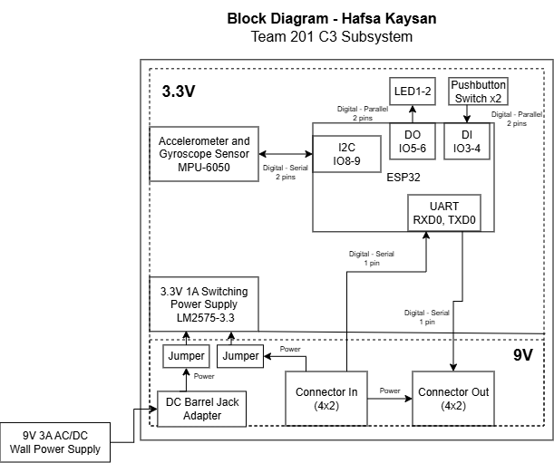

## Overview
The purpose of this block diagram is to display what is necessary for the subsystem to function and to properly allocate resources such as pins and power according to the previously stated requirements and concept. In order to power the subsystem, a power source over 7V, such as 12V 2A wall supply, is needed to pass through a 3.3V 1.5A regulator which powers the module's major components. The primary sensor is the Joystick Potentiometer, which will provide a wide array of control to the user using two ADC pins. A simple digital switch is also included to turn on and off the device. In response to these inputs as well as data collected from other modules, the OLED screen will display relevant information to the user via I2C communication and an LED will be used for debugging. Communication between modules will be facilitated through UART and digital pins, and the Snap Debugger will allow for the programming of the PIC. Stretch requirements listed in the requirements section are not included in this block diagram but may be added in the future using what pins and other resources are left over.

## Block Diagram 

**Figure 1:** Individual Block Diagram for main hub module with display, controller, and UART pinouts. PDF version [*here*](EGR314_BlockDiagram.drawio.pdf)
