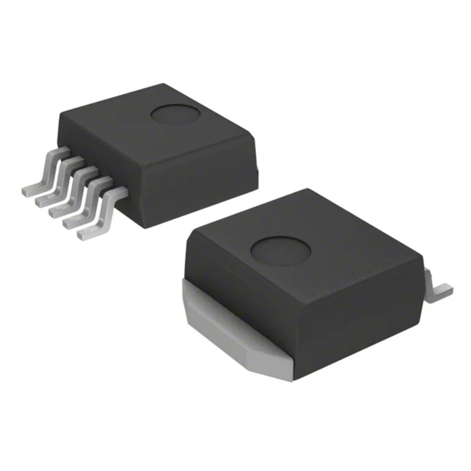
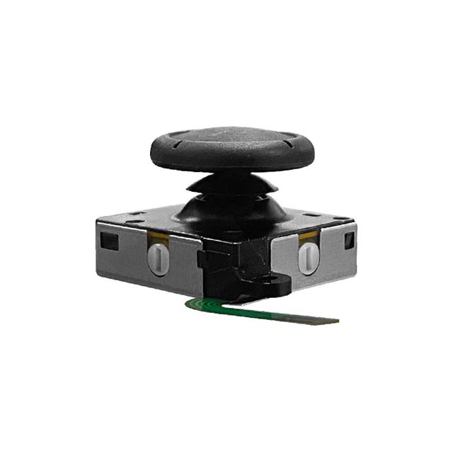
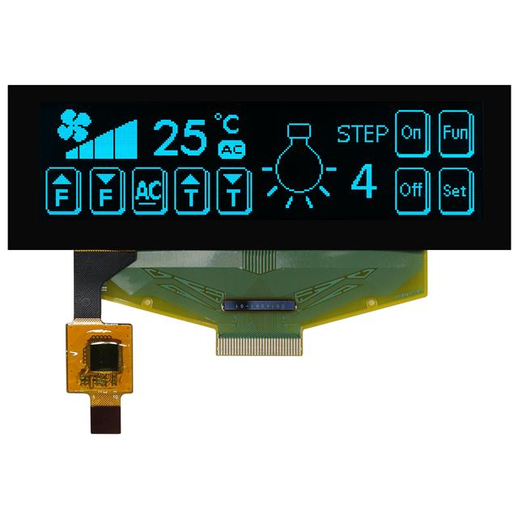
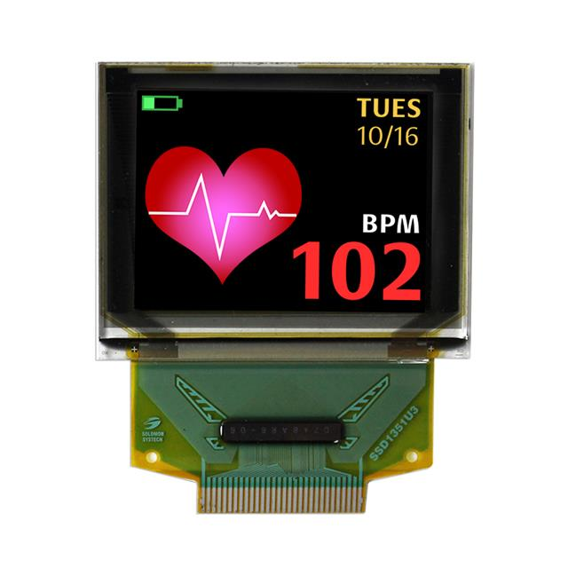

## Module's Selected Major Components

The following sections are the selected major components necessary for the Human-Machine Interface module to function. According to the project requirements, this subsystem must have a 3.3 volt switching regulator, a sensor for users to input commands into the interface, and an OLED screen to display data.

### Power Management

**Voltage Regulator**

1. Custom Circuit

    | Pros                                      | Cons                                                             |
    | ----------------------------------------- | ---------------------------------------------------------------- |
    | Components provided by course             | Cannot change voltage setting after it has been soldered         |
    | Can be deconstructed if needed            | Requires more traces on PCB                                      |
    |                                           | Components provided need pliers to meet surface mount constraint |

2. LM2575 Regulator Circuit

    

    * $2.16/each
    * [link to product](https://www.digikey.com/en/products/detail/onsemi/LM2575D2T-3-3R4G/1476688)

    | Pros                                      | Cons                                                             |
    | ----------------------------------------- | ---------------------------------------------------------------- |
    | Provided by course                        | Requires external components                                     |
    | Meets surface mount constraint of project |                                                                  |
    | Supplies 3.3V                             |                                                                  |

4. BU33UV7NUX-E2 Regulator

    

    * $1.13/each
    * [link to product](https://www.digikey.com/en/products/detail/rohm-semiconductor/BU33UV7NUX-E2/8125892)

    | Pros                                      | Cons                                                             |
    | ----------------------------------------- | ---------------------------------------------------------------- |
    | Meets surface mount constraint of project | Requires external components                                     |
    | Supplies 3.3V                             | 11 solder points                                                 |
   
**Rationale:** The course-provided LM2575 regulator circuit is the best fit for this module because it is the easiest since it is already available for testing and development, provides the correct voltage, and only has five solder points.

### Sensor

**Interface Inputs**

1. Pushbutton Switch

    

    * $0.10/each
    * [link to product](https://www.digikey.com/en/products/detail/same-sky-formerly-cui-devices-/TS02-66-70-BK-100-LCR-D/15634375?gclsrc=aw.ds&gad_source=1&gad_campaignid=20243136172&gbraid=0AAAAADrbLlgyNuYs-cl0PtfhcjKVghZ2g&gclid=Cj0KCQiA7rDMBhCjARIsAGDBuED1I2dSinnbzKlKYw7YbFCBgHToXbUx1UQH2Z5pEn1AzISfxalpZysaAujTEALw_wcB)

    | Pros                                      | Cons                                                             |
    | ----------------------------------------- | ---------------------------------------------------------------- |
    | Provided by course                        | Might require de-bounce circuit                                  |
    | Requires few traces in PCB                | Needs pliers to meet surface mount constraint                    |
    | Inexpensive                               | May wear down easily                                             |

2. 10k Potentiometer

    

    * $1.30/each
    * [link to product](https://www.digikey.com/en/products/detail/bourns-inc/PDB181-K420K-103B/2564744?gclsrc=aw.ds&gad_source=1&gad_campaignid=20504615262&gbraid=0AAAAADrbLlhbZlKJDuY9Fz_HBeq6PPHa2&gclid=Cj0KCQiA7rDMBhCjARIsAGDBuEAze5-TDhEY5fqmwQEW-UMyNoQRK8p2a5l4NHsZZxzEn08dejNrVoYaArlTEALw_wcB)

    | Pros                                      | Cons                                                             |
    | ----------------------------------------- | ---------------------------------------------------------------- |
    | Provided by course                        | Requires external components and support circuitry for interface |
    | Allows for analog input                   | Needs pliers to meet surface mount constraint                    |

3. Joystick Potentiometer

    

    * $5.73/each
    * [link to product](https://www.digikey.com/en/products/detail/favor-electronics/FJ05K-S1B5KB0/16893757?s=N4IgjCBcoExgbFUBjKAzAhgGwM4FMAaEAeygG0QAWABgGYBWAThAF0iAHAFyhAGVOATgEsAdgHMQAX2lA)

    | Pros                                      | Cons                                                             |
    | ----------------------------------------- | ---------------------------------------------------------------- |
    | Meets surface mount consraint of project  | Needs several traces and pins                                    |
    | Allows for multiple analog inputs         | Expensive                                                        |

**Rationale:** Potentiometers seem to be the best fit for operating the HMI. Using two or more potentiometers will require a few more traces than a pushbutton would but would avoid issues such as debouncing. If needed, however, we can add pushbuttons to the module for minor functions.

### Actuator

**HMI OLED Screen**

1. SSD1306 0.96"

    

    * $1/each
    * [link to product](https://www.amazon.com/Songhe-0-96-inch-I2C-Raspberry/dp/B085WCRS7C/)

    | Pros                                      | Cons                                                             |
    | ----------------------------------------- | ---------------------------------------------------------------- |
    | Provided by course                        | Small Screen                                                     |
    | Compatible with ESP32                     | Needs to be desoldered for surface mount                         |

2. WEX025664BSPP3N00000 3.12"

    

    * $32.66/each
    * [link to product](http://www.digikey.com/product-detail/en/ECS-40.3-S-5PX-TR/XC1259TR-ND/827366)

    | Pros                                      | Cons                                                             |
    | ----------------------------------------- | ---------------------------------------------------------------- |
    | Larger Screen                             | Expensive                                                        |
    | Meets surface mount constraint of project | Has 30 pins                                                      |

3. NHD-1.27-12896G 1.27"

    

    * $60/each
    * [link to product](http://www.digikey.com/product-detail/en/ECS-40.3-S-5PX-TR/XC1259TR-ND/827366)

    | Pros                                      | Cons                                                             |
    | ----------------------------------------- | ---------------------------------------------------------------- |
    | RGB                                       | Expensive                                                        |
    | Meets surface mount constraint of project | Has 30 pins                                                      |

**Rationale:** The SSD1306 OLED screen is the best option for this project because of how expensive other OLED screens are. Even though the screen is small, we can use multiple OLED screens with each displaying different data for the user if necessary.
