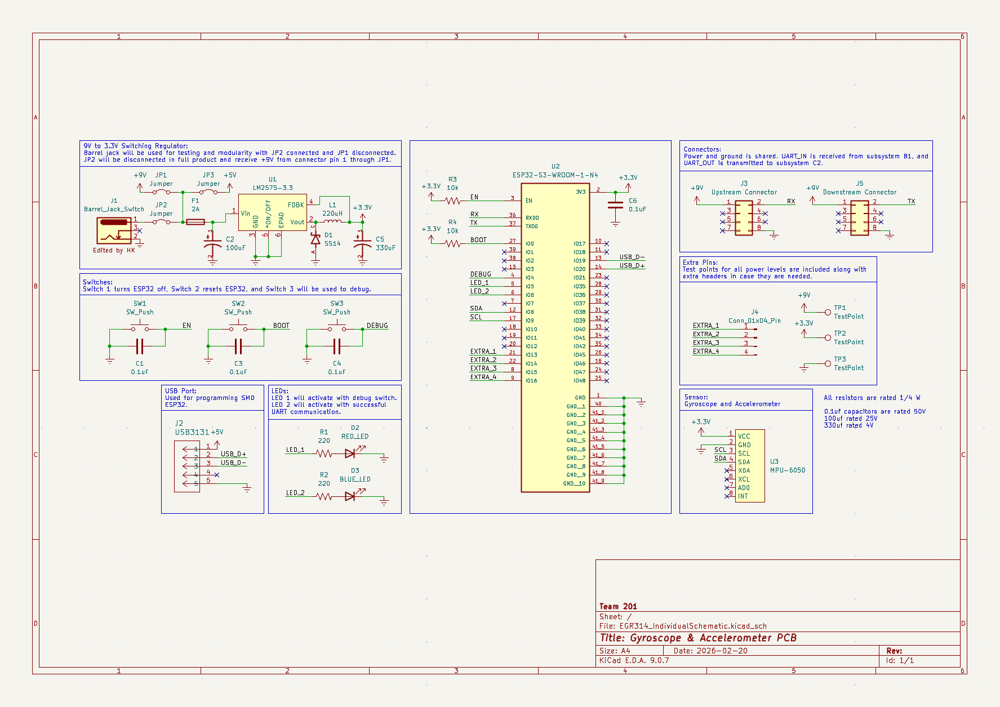

## Overview

This schematic is design to support the gyroscope and accelerometer functionality of the device using a 3.3 voltage regulator to power the ESP32 and MPU-6050 sensor. The upstream header of the subsystem will receive commands from other subsystems in the UART chain, transmit the gyroscope data to subsystem C2 to adjust the camera arm, and send the accelerometer data down the UART chain to the on-board WiFi subsystem. This project requires that most components including the ESP32 be surface mounted, so the necessary peripherals have been added for microcontroller functionality such as the enable and boot switches, and the USB port for programmability. Test points, extra headers, LEDs, and a debugging switch have also been added to assist with board development.

**Figure 1:** Showing a example schematic.

## Resouces

The schematic as a PDF download is available [*here*](EGR314_IndividualSchematic.pdf), and the Zip folder of the project [*here*](EGR314_IndividualSchematic.zip).
