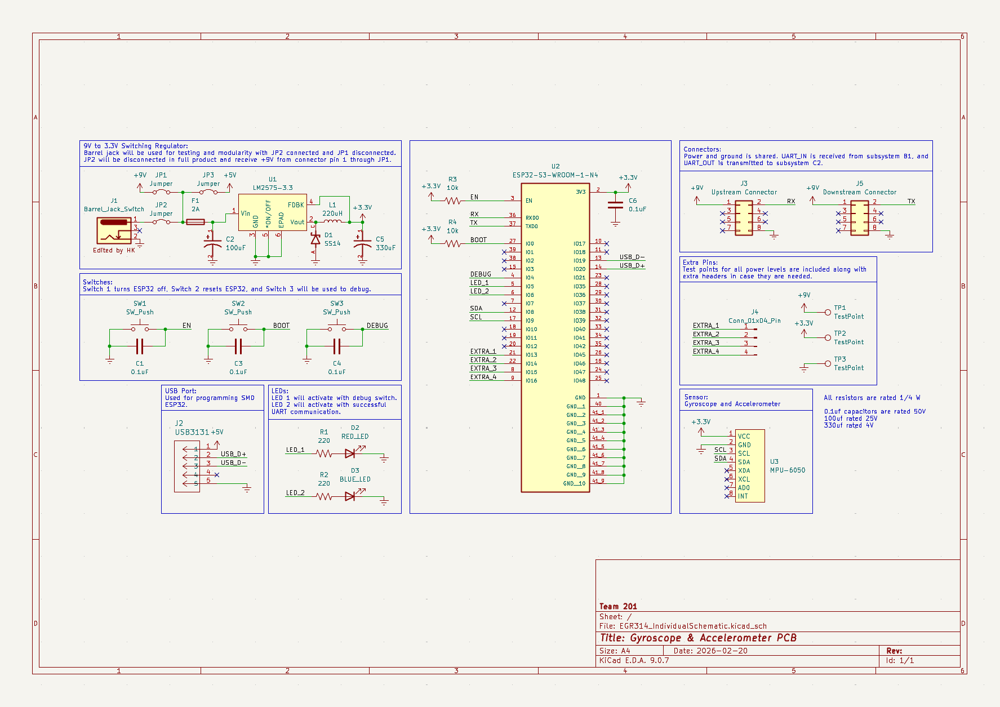

## Overview

This schematic is design to support the gyroscope and accelerometer functionality of the device using a 3.3 voltage regulator to power the ESP32 and MPU-6050 sensor. The upstream header of the subsystem will receive commands from other subsystems in the UART chain, transmit the gyroscope data to subsystem C2 to adjust the camera arm, and send the accelerometer data down the UART chain to the on-board WiFi subsystem. This project requires that most components including the ESP32 be surface mounted, so the necessary peripherals have been added for microcontroller functionality such as the enable and boot switches as well as the USB port for programmability. Test points, extra headers, LEDs, a debugging switch, and jumpers to switch between shared power and a wall-mounted power supply have also been added to assist with board development.

The subsystem schematic was converted into a PCB design using the KiCAD editor. Footprints for each component was taken from datasheets in the BOM, Kicad libraries, or my own designs. The PCB was then checked in the built-in DRC and its gerber files sent to JLCDFM to prepare for manufacturing.

## Schematic

**Figure 1:** Gyroscope & Accelerometer Subsystem Schematic

## Resources

The schematic as a PDF download is available [*here*](EGR314_IndividualSchematic.pdf), the pcb as a pdf [*here*](pcb.pdf), the gerber files [*here*](Gerber.zip), the Zip folder of the project [*here*](EGR314_IndividualSchematic.zip), and the code used to test the sensor and UART communication [*here*](MPU6050_test.zip).
