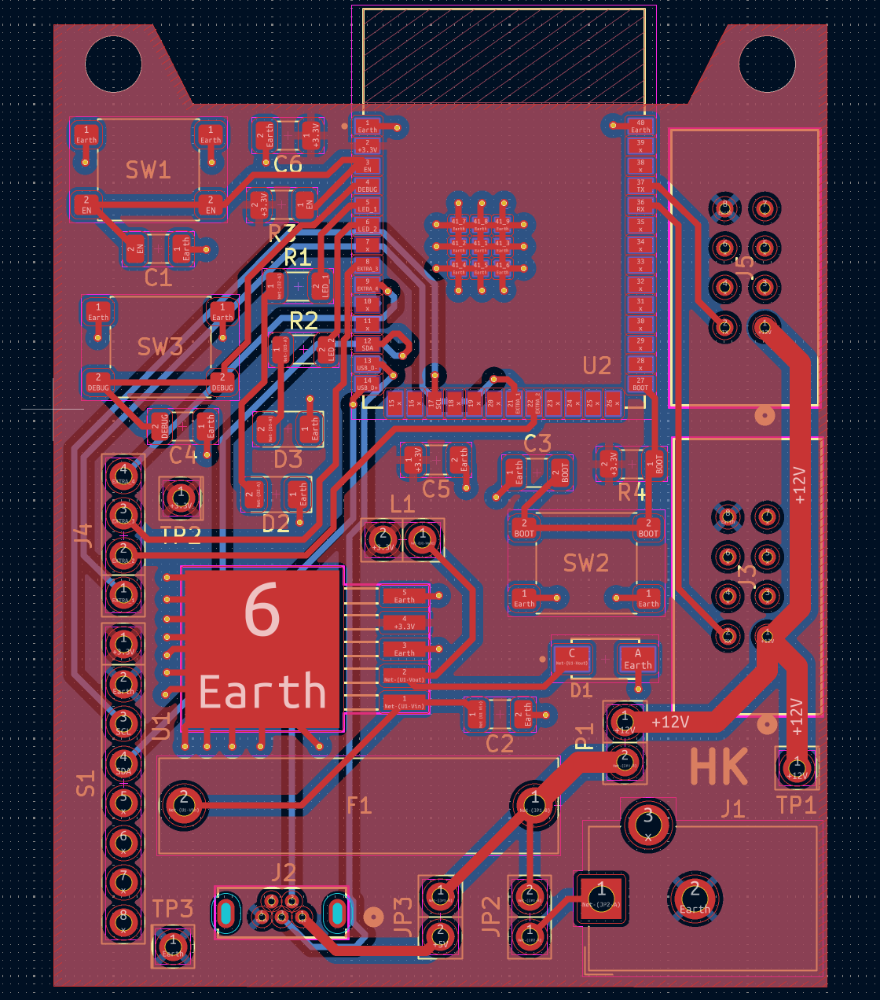

## PCB

**Figure 1:** PCB design made in KiCad for Gyroscope & Accelerometer Subsystem

## Resources

The project zip file can be found [*here*](EGR314_IndividualSchematic.zip), the pcb as a pdf [*here*](pcb.pdf), and the gerber files [*here*](Gerber.zip).
