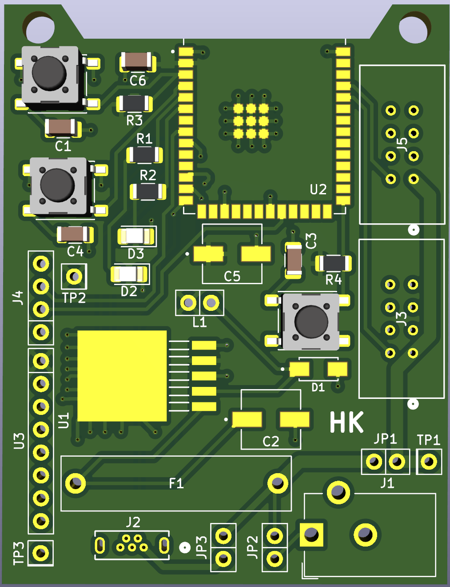
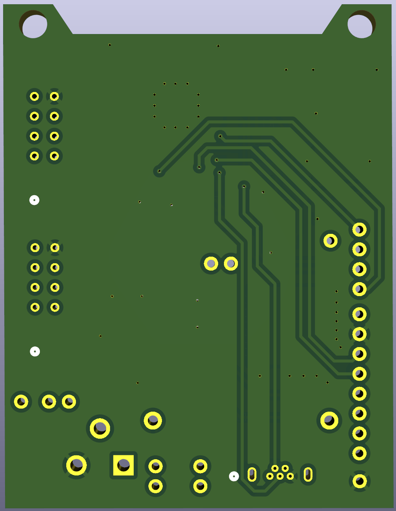
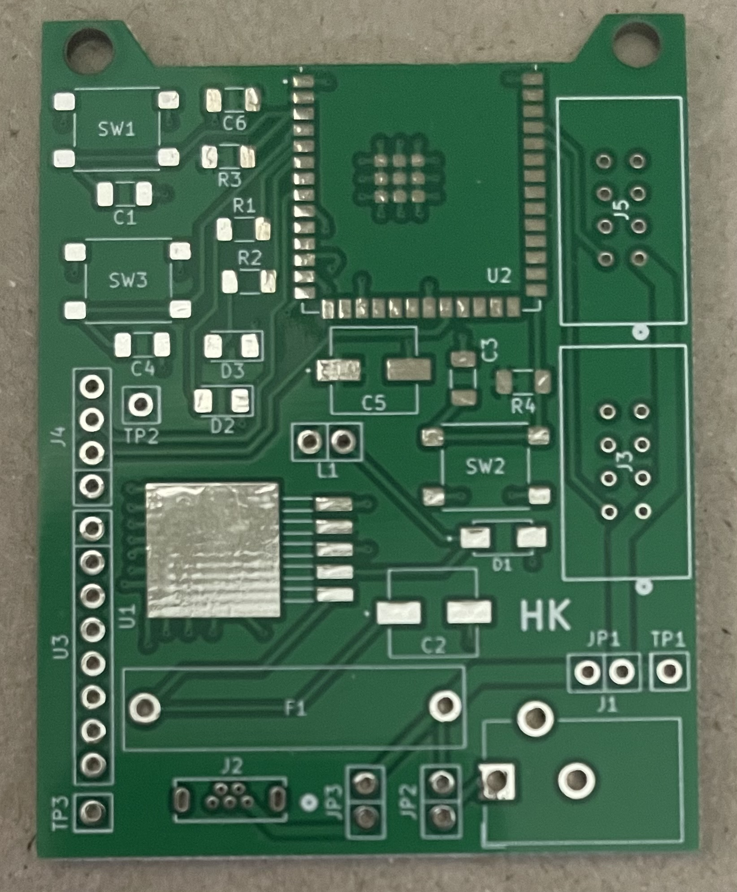
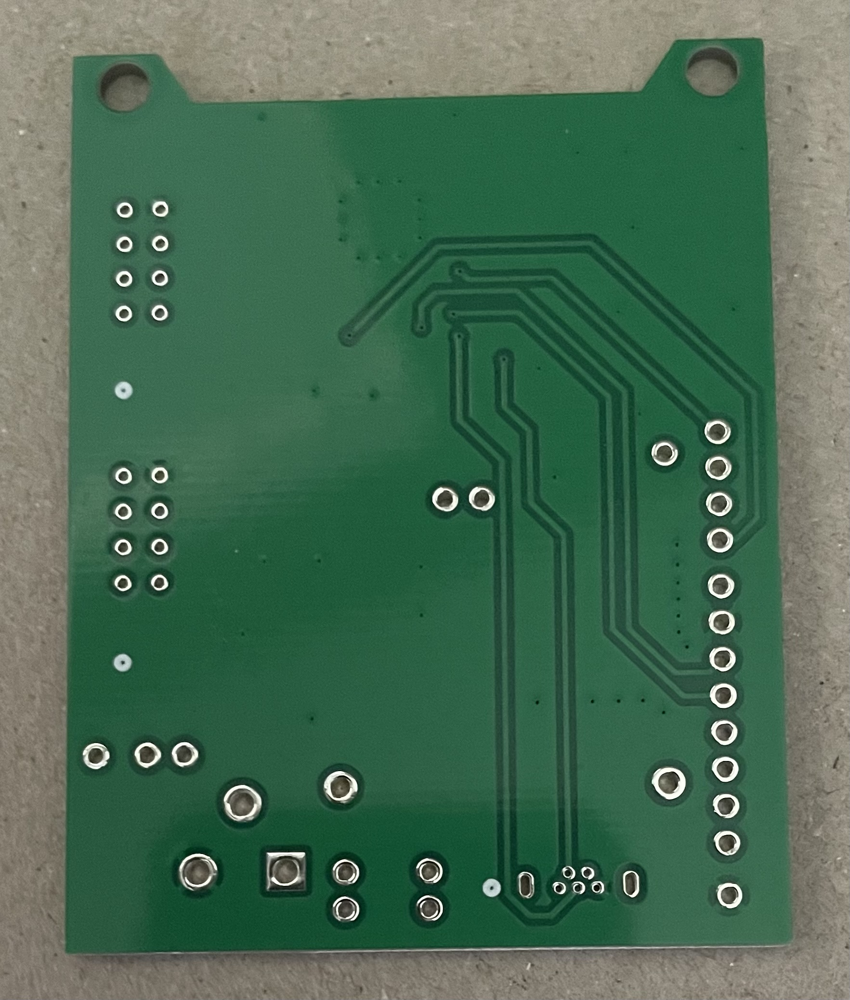
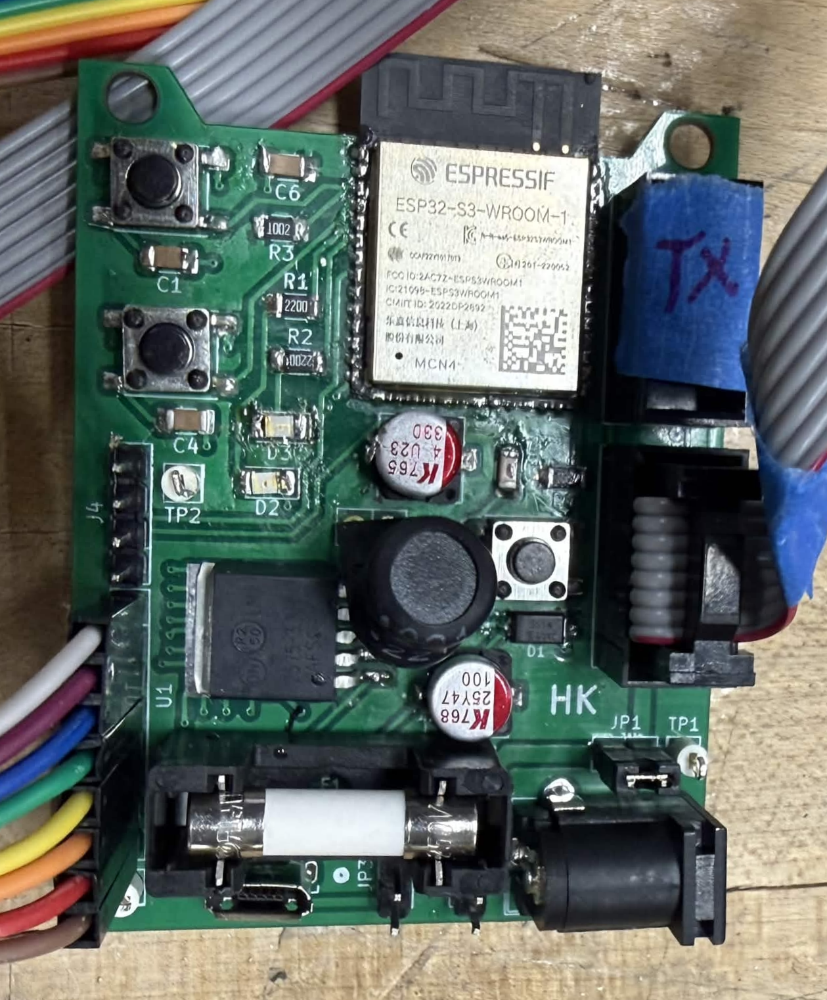
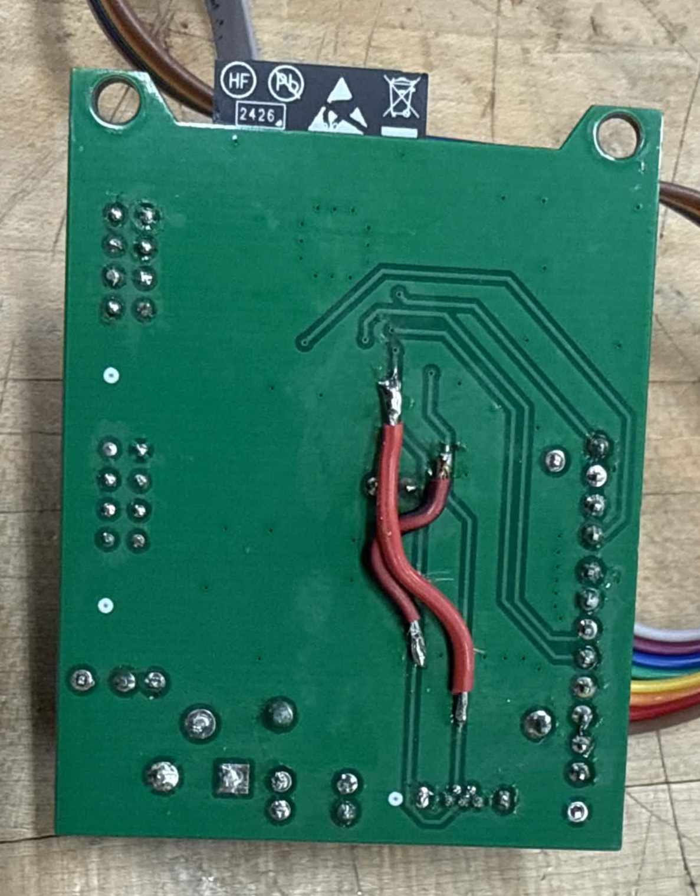

## Overview

The subsystem schematic was converted into a PCB design using the KiCAD editor. Footprints for each component was taken from datasheets in found in the links located in the BOM, standard footprints from Kicad libraries, or my own footprint designs. The PCB was then checked for errors in the built-in DRC as well as the JLCDFM, and its gerber files were then sent to JLCPCB for manufacturing.

## PCB

**Figure 1:** Front face of PCB Design in KiCAD 3D viewer

**Figure 2:** Back face of PCB Design in KiCAD 3D viewer

**Figure 3:** Front face of PCB

**Figure 4:** Back face of PCB

**Figure 5:** Front face of finalized PCB

**Figure 6:** Back face of finalized PCB

## Resources

The PCB as a pdf download is available [*here*](pcb.pdf), the gerber files [*here*](Gerber.zip), the Zip folder of the project [*here*](EGR314_IndividualSchematic.zip), and the code used to test the sensor and UART communication [*here*](MPU6050_test.zip).
